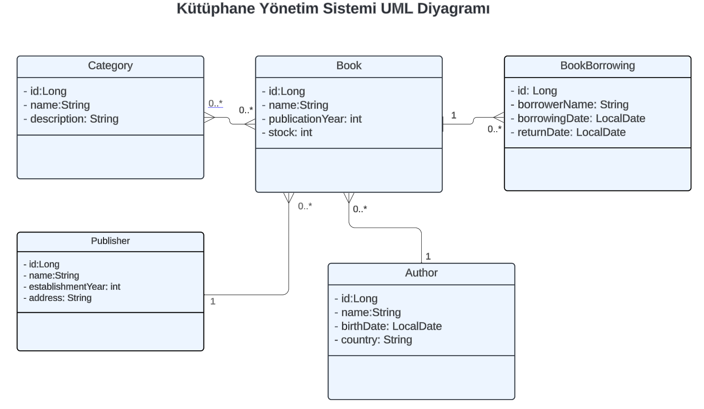

# Pratik - Rest API Geliştirme

Hafta-11'de, bir Maven projesi açarak Kütüphane Yönetim Sistemi Projesi için entity sınıflarını ve bunların arasındaki ilişkileri tanımlamıştınız.

Şimdi bu projeyi Spring Boot ile Rest API olarak geliştirmenizi istiyoruz.

## Ödev

Bu projede CRUD operasyonları yapabilen bir Rest API yazacaksınız.

- Spring Initializr'dan bir Spring Boot projesi açın ve gerekli dependency'leri tanımlayın. (Lombok kullanabilirsiniz.)
- Projeyi katmanlı mimariye göre geliştirin. (Entity, repository, service ve controller katmanlarınız olmalı.)
- Service katmanında iş mantığı ile ilgili kodlamaları yapın.
- Kategori silme işleminde metodu void olarak değil String olarak tanımlayın.
- BookBorrowing tablosuna yeni kayıt yapılırken ödünç verilen kitabın stok kontrolünü yapmalısınız.
- Controller'da HTTP statülerini kullanın.
- IoC, DI kullanımında constructor injection'dan faydalanın.
- UML diyagramda belirtilen entity sınıflarını ve bunların arasındaki ilişkileri belirleyin.
- Gerekli anotasyonları (@Entity, @Table, @Id, @OneToMany, @ManyToOne, @ManyToMany) yazın.
- Gerekli Fetch ve Cascade anotasyonlarını yazın.
- Entity'lerde temel değişkenler belirtilmiş olup entity'ler arası ilişkilere göre sizler değişken eklemelisiniz.
- Yayınevi GET isteklerinde adres gelmeyecek şekilde ve kitap ödünç alan bilgilerinin güncellenmesinde e-mail girişi olmayacak şekilde Request ve response dto kullanın.
- Validator kullanın ve gerekli anotasyonları yazın.
- Postgresql kullanarak veri tabanında tabloları oluşturun.
- Readme dosyasına tüm end pointleri gösteren bir tablo ekleyin.

## Entity'ler

### Kitap (Book)

- id (Benzersiz kitap kimliği)
- name(Kitap adı)
- publicationYear (Yayın yılı)
- stock (Kütüphanedeki miktarı)

### Yazar (Author)

- id (Benzersiz yazar kimliği)
- name (Yazarın adı)
- birthDate (Yazarın doğum yılı)
- country (Yazarın ülkesi)

### Kategoriler (Category)

- id (Benzersiz kategori kimliği)
- name (Kategori adı)
- description (Kategori tanımı)

### Yayınevi (Publisher)

- id (Benzersiz kimliği)
- name (Yayınevi ismi)
- establishmentYear (Kuruluş yılı)
- address (Yayınevi adresi)

### Kitap Ödünç Alma (BookBorrowing)

- id (Benzersiz kimliği)
- borrowerName (Kitap ödünç alan kişi adı soyadı)
- borrowingDate (Kitap ödünç alma tarihi)
- returnDate (Kitabın teslim edildiği tarih, ilk kayıtta null olacak. Kitap teslim edilince tarih güncellenecek)

## İlişkiler

- Bir kitabın bir yazarı olabilir, bir yazarın birden fazla kitabı olabilir. (One-to-Many ilişkisi).
- Bir kategori birden fazla kitaba sahip olabilirken, bir kitap birden fazla kategoriye ait olabilir. (Many-to-Many ilişkisi).
- Bir kitabın bir yayınevi olabilir, bir yayınevinin birden fazla kitabı olabilir. (One-to-Many ilişkisi).
- Bir kitap birden fazla ödünç alma işlemine sahip olabilir, ancak her ödünç alma işlemi yalnızca bir kitaba ait olabilir. (One-to-Many ilişkisi).

